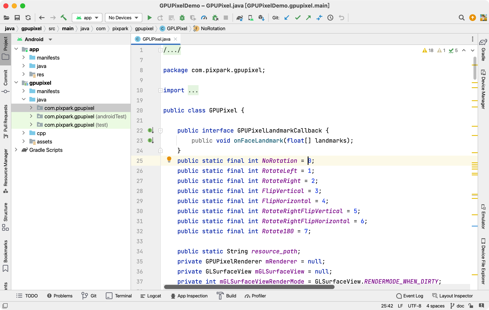
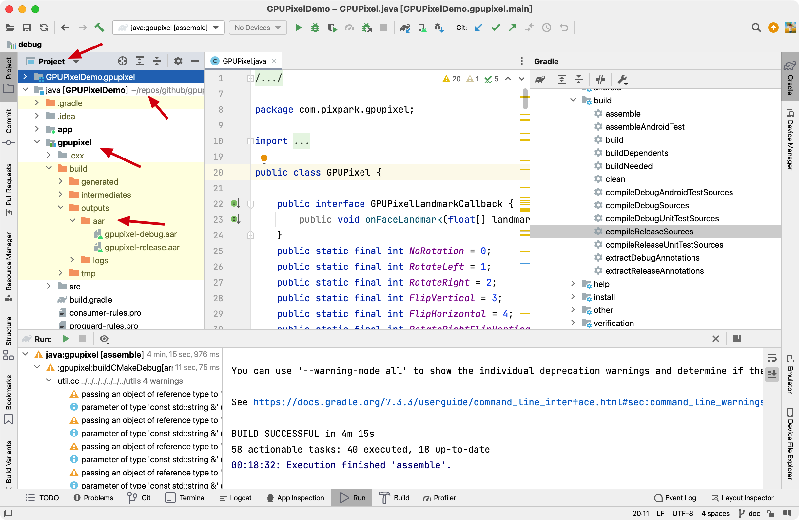

# 编译

本章将介绍各个系统平台GPUPixel库的编译方法

::: tip
从 [v1.1.0](https://github.com/pixpark/gpupixel/releases/tag/v1.1.1) 版本开始，源码使用CMake编译。最新编译好的各个平台库可以从[这里](https://github.com/pixpark/gpupixel/releases/latest)找到
:::

## iOS
工程根目录下执行如下命令

**生成工程**
::: code-group
```bash [Arm64]
cmake -G Xcode -B build -S src -DCMAKE_TOOLCHAIN_FILE=../toolchain/ios.toolchain.cmake -DPLATFORM=OS64
```
:::

**编译**
::: code-group

```bash [Release]
cmake --build build --config Release
```

```bash [Debug]
cmake --build build --config Debug
```
:::

**输出**

编译输出位于项目根目录下的 `output` 路径，包含内容如下
```bash
output
├── include   # 头文件
├── library   # 库文件
└── resources #资源文件
```
对于iOS只需要使用 `library` 下的 `.framework` 库即可，里面已经包含头文件和资源文件

## Mac
工程根目录下执行如下命令

**生成工程**
::: code-group
```bash [Apple Silicon]
cmake -G Xcode -B build -S src -DCMAKE_TOOLCHAIN_FILE=../toolchain/ios.toolchain.cmake -DPLATFORM=MAC_ARM64
```
```bash [Intel]
cmake -G Xcode -B build -S src -DCMAKE_TOOLCHAIN_FILE=../toolchain/ios.toolchain.cmake -DPLATFORM=MAC
```
:::
 
**编译**
::: code-group

```bash [Release]
cmake --build build --config Release
```

```bash [Debug]
cmake --build build --config Debug
```
:::

**输出**

编译输出位于项目根目录下的 `output` 路径，包含内容如下
```bash
output
├── include   #头文件
├── library   #库文件
└── resources #资源文件
```
对于MacOS只需要使用 `library` 下的 `.framework` 库即可，里面已经包含头文件和资源文件

## Android

使用Android Studio打开目录 `src/android/java`, 开始自动下载 gradle 等依赖

**工程结构**

包含demo和 gpupixel module, 如下



**编译**

双击右侧 `gradle -> gpupixel -> build -> assemble` 开始编译


**输出**

切换到 project 视图，输出位于： `src/android/java/gpupixel/build/outputs/aar`



**Gradle 命令编译**

如果已经配置号 gradle 命令环境，也可以使用 `gradlew` 编译

```bash
./gradlew :gpupixel:assembleRelease
```

输出位于：`src/android/java/gpupixel/build/outputs/aar`

## Windows

Windows编译需要安装 Cmake 和 MinGW64.

**生成工程**

```bash
# Generate project
cmake -G "MinGW Makefiles" -B build -S src

```
**编译**
::: code-group

```bash [Release]
cmake --build build -DCMAKE_BUILD_TYPE=Release
```

```bash [Debug]
cmake --build build -DCMAKE_BUILD_TYPE=Debug
```
:::
 
**输出**

编译输出位于项目根目录下的 `output` 路径，包含内容如下
```bash
output
├── include   #头文件
├── library   #库文件
└── resources #资源文件
```

## Linux (Test On Ubuntu)

**环境配置**

```bash
# install cmake 
sudo apt-get install cmake pkg-config
# install dependent lib
sudo apt-get install mesa-utils libglu1-mesa-dev freeglut3-dev mesa-common-dev libglfw3-dev
```

**生成工程**
```bash
# Generate project
cmake -B build -S src
```
**编译**
::: code-group

```bash [Release]
cmake --build build -DCMAKE_BUILD_TYPE=Release
```

```bash [Debug]
cmake --build build -DCMAKE_BUILD_TYPE=Debug
```
:::

**输出**

编译输出位于项目根目录下的 `output` 路径，包含内容如下
```bash
output
├── include   #头文件
├── library   #库文件
└── resources #资源文件
```

## Github Workflows
自动化编译可以参考
[GPUPixel Github Build Workflows](https://github.com/pixpark/gpupixel/blob/main/.github/workflows/cmake-and-release.yml)，脚本化了上面讲到的各个平台的编译命令